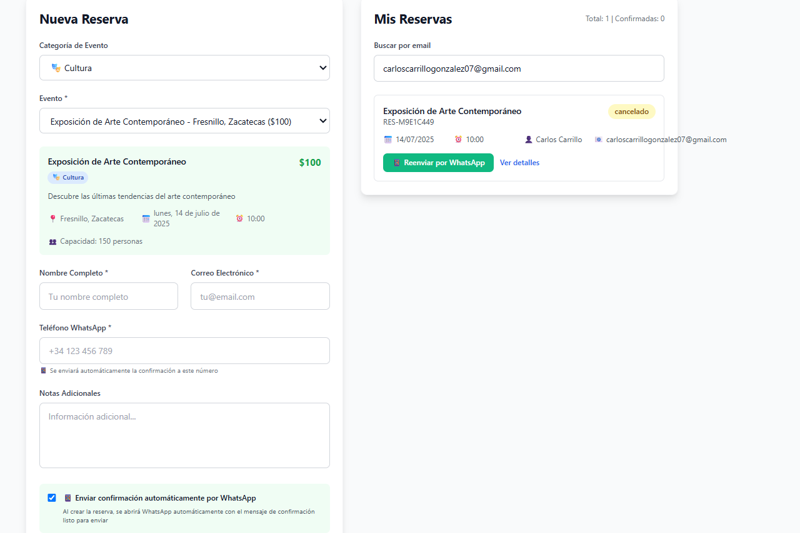
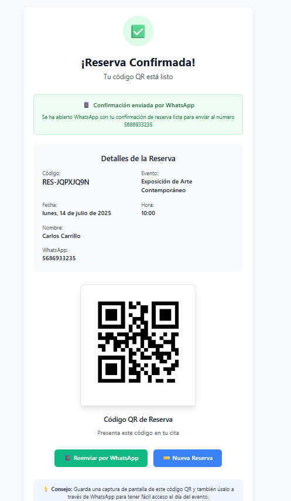

# 🎟️ Event Reservation System with QR & WhatsApp Confirmation

A modern Vue.js application that allows users to book events, receive a unique QR code, and automatically send the confirmation via WhatsApp. Perfect for cultural, artistic, or family-oriented events.

## 📸 Screenshots

### 📝 New Reservation Form


### ✅ Confirmation with QR & WhatsApp


## 🚀 Features

- Select category and specific event
- Auto-filled event details (date, time, capacity, price)
- Reservation form with validation
- QR code generation for entry verification
- Automatic WhatsApp confirmation message with QR code
- Reservation tracking with status (confirmed, canceled)
- Responsive and modern UI

## 🛠️ Built With

- [Vue.js 3](https://vuejs.org/) - Frontend Framework

## 📦 Installation

```bash
# Clone this repo
git clone https://github.com/your-username/event-reservation-vue.git
cd event-reservation-vue

# Install dependencies
npm install

# Run the development server
npm run dev